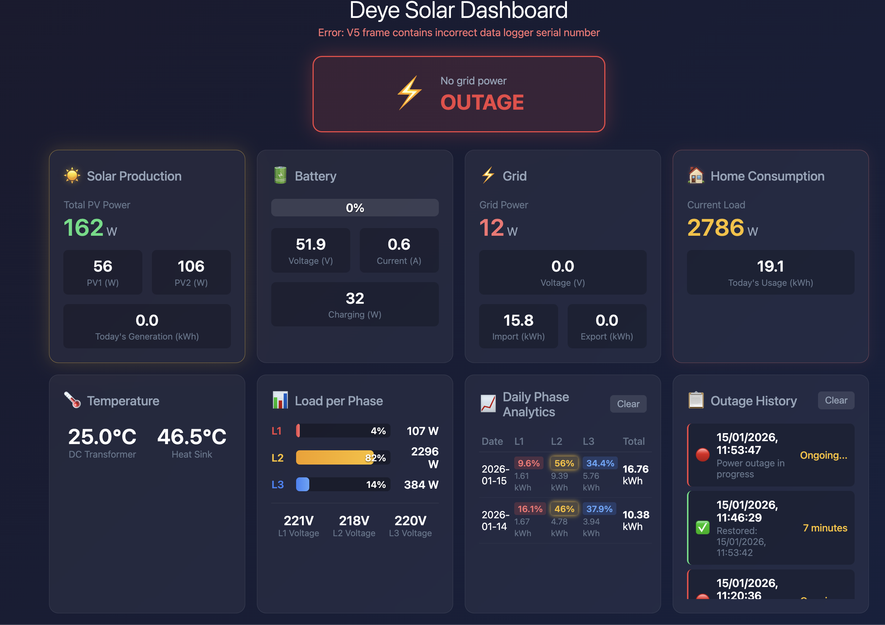

# Deye Solar Dashboard

A simple, lightweight web dashboard for monitoring Deye solar inverters in real-time.



## Features

- **Real-time monitoring**: Solar production, battery status, grid power, and load consumption
- **3-phase load analytics**: Per-phase power distribution with daily statistics
- **Grid outage detection**: Voice alerts and browser notifications when power goes out
- **Outage history**: Track and review past power outages
- **Responsive design**: Works on desktop and mobile devices
- **Animations**: Visual feedback for charging, discharging, and power flow

## Requirements

- Python 3.7+
- Deye inverter with Solarman Wi-Fi logger
- Network access to the inverter

## Installation

1. Clone the repository:
```bash
git clone https://github.com/ivanursul/deye-dashboard.git
cd deye-dashboard
```

2. Install dependencies:
```bash
pip install -r requirements.txt
```

3. Configure your inverter connection:
```bash
export INVERTER_IP="192.168.1.100"
export LOGGER_SERIAL="1234567890"
```

Or create a `.env` file based on `.env.example`.

4. Run the dashboard:
```bash
python app.py
```

5. Open http://localhost:8080 in your browser.

## Configuration

| Environment Variable | Description | Default |
|---------------------|-------------|---------|
| `INVERTER_IP` | IP address of your Deye inverter | `192.168.1.100` |
| `LOGGER_SERIAL` | Serial number of the Solarman logger | `1234567890` |
| `OUTAGE_HISTORY_FILE` | Path to outage history JSON file | `outage_history.json` |
| `PHASE_STATS_FILE` | Path to phase statistics JSON file | `phase_stats.json` |

## Finding Your Inverter Details

### Inverter IP
Check your router's connected devices list or use:
```bash
nmap -sP 192.168.1.0/24
```

### Logger Serial Number
The serial number is printed on the Solarman Wi-Fi logger stick, or can be found in the Solarman app.

## Utility Scripts

### Scan for registers
If your inverter model uses different registers, use these scripts to find the correct ones:

```bash
# Scan for battery voltage register
python scan_battery.py

# Scan for phase-related registers
python scan_phases.py
```

## API Endpoints

| Endpoint | Method | Description |
|----------|--------|-------------|
| `/api/data` | GET | Current inverter readings |
| `/api/phase-stats` | GET | Daily phase statistics |
| `/api/outages` | GET | Outage history |
| `/api/outages` | POST | Record outage event |
| `/api/outages/clear` | POST | Clear outage history |
| `/api/phase-stats/clear` | POST | Clear phase statistics |

## License

MIT License
